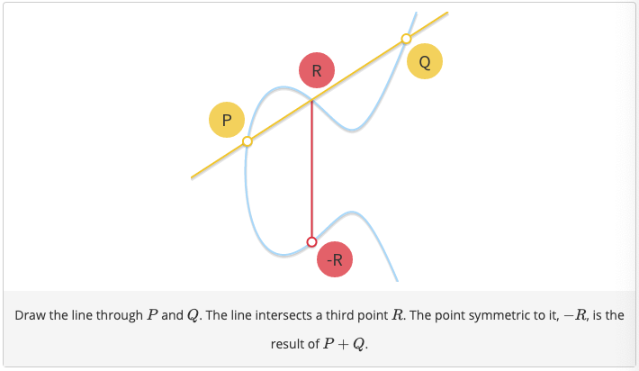

# ETH-exercises
some graded and ungraded homeworks from different courses offered at ETH Zurich :bulb:

## PCA on faces :woman: :older_man: :girl: :boy:
This exercise comes from the course Computational Intelligence Lab in the spring semester of 2020. Here we perform PCA on the variance-covariance matrix of the data to extract the principal components corresponding to 'principal eigenfaces', to later reconstruct an image as a combination of only these 'principal eigenfaces'.

## Signal Processing & Wavelets
This exercises comes from the course Computational Intelligence Lab in the spring semester of 2020. Here we represent our signal in a different basis, namely the Haar basis. We then try to get rid of noise by treshholding the signal in the Haar basis, and then to transform it back into the original basis. 

## Analysis of a high school class social network 
This exercise comes from the course Social Networks: Analaysis, Theory and Applications offered at ETH Zurich in the spring semester of 2020. The analysis was performed on a high-school classroom data set in Hungary. The Analysis was performed both on a "friendship network", where an edge in the graph represents a friendship as well as a trust network, where an edge represents a trust relationship. 

## Analysis of a London Street Gang social network
This exercise comes from the course Social Networks: Analaysis, Theory and Applications offered at ETH Zurich in the spring semester of 2020. In this exercise we study the social network of a gang based in London. The data is on co-offending in a London-based inner-city street gang, 2005-2009, operating from a social housing estate. The data comes from anonymized police arrest and conviction data for all confirmed members of the gang. It consists of four networks: hang-out together, co-offend together, commit serious crime together and commit serious crime together & kin.

We compute a number of simple network statistics, like degree distribution, proportion of homophilic ties and modularity. We also provide a number of network plots and comment on our observations throughout.

We then perform Conditional Uniform Graph tests to test whether same age group ties and ties between individuals of a common birthplace are more likely, first conditioned on network size and then additionally on the number of isolated nodes. Our findings suggest e.g. that individuals of a common birthplace are significantly more likely to commit serious crime together.

## Classification of medical images
This exercise is was the second graded project of the course Advanced Machine Learning offered at ETH Zurich in the fall semester of 2019. The task was a 3-class disease classification task with a highly imbalanced dataset derived from medical images. Our final solution was SVC with the parameter balanced set to true, which takes care of the fact that the data is unbalanced. In addition, we used standard scaler from sk-learn to normalize our data. 

## Classification of ECG signals
This exercise was the third graded project of the course Advanced Machine Learning offered at ETH Zurich in the fall semester of 2019. We had to perform multi-class classification on time series data, in the form of ECG signals. In this project we had to perform feature engineering. Based on researching properties of ECG signals, we extracted relevant features from the signal. These were amongst others the R peaks, in particular the amplitude of the, the time interval between the R peaks and the heart rate. For the extraction of these features we made use of the biosppy library. Our final model was xgboost (a gradient boosting classifier). We in addition normalized our data using the Robust Scaler from sk-learn.  

## Elliptic Curve Cryptography.
The following two exercises on Elliptic Curve Cryptography formed the first graded homework of the course Information Security Lab offered at ETH Zurich in the autumn semester of 2020. In the first part, we focus on implementing ECDSA. In particular, we implement several functions such as the addition of points on elliptic curves and a scalar multiply function. Note that addition on elliptic curves is defined as follows (as indicated in the drawing).

We focus on implementing cryptanalysis of ECDSA based on nonce leakages. I implemented attack algorithms that recover the secret ECDSA signing key based on either complete or partial information about the nonce(s) used in the ECDSA signing algorithm. In the exercise, we had to consider three flavors of cryptanalytic attacks, namely known-nonce attacks, repeated-nonce attacks and partially-known-nonce attacks. 

## TLC Cryptographic Protocol

## SCION Network

